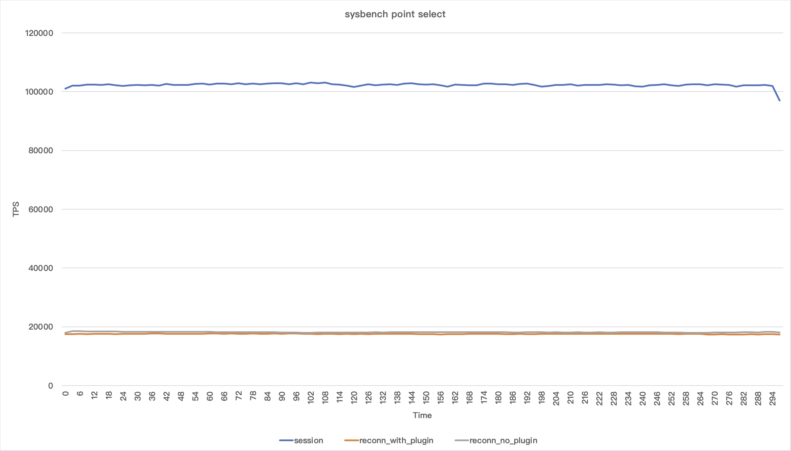

# Usage

1. install [spdlog](https://github.com/gabime/spdlog)
2. put `audit_connection` to `mysql_source_code/plugin`
    - e.g. /root/mysql-8.0.29/plugin/audit_connection
3. compile mysql as usual

# Install

1. after compiling, put `plugin_output_directory/audit_connection.so` in `<mysql_base_dir>/lib/plugin`
2. place the following configuration in the `[mysqld]` section of `/etc/my.cnf`

```ini
plugin-load-add=audit_connection.so
audit_connection=FORCE_PLUS_PERMANENT
```

# Log roration

1. <data_dir>/audit_connection.log;
2. 50MB per log file;
3. keep 7 files;

# Performance


